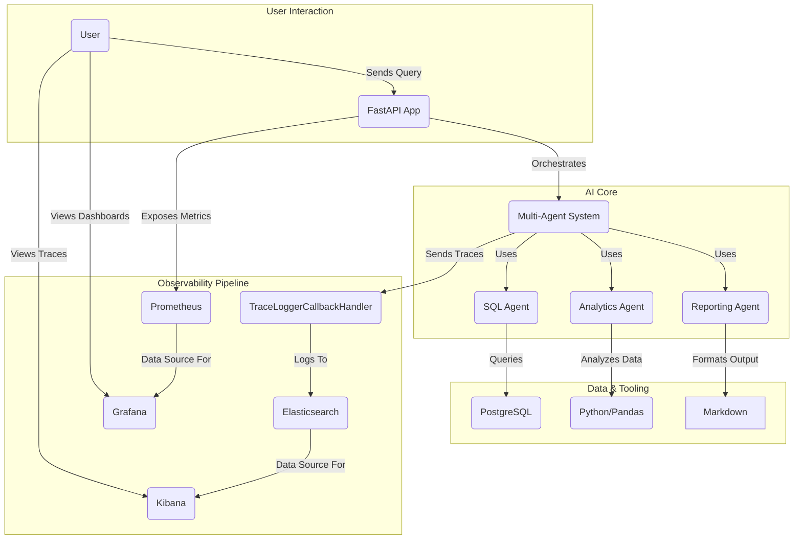

# AI Observability Stack

A comprehensive observability platform with AI-powered business intelligence capabilities.

## Services

- **FastAPI App** (Cognosys BI Agent): `http://localhost:8000`
- **PostgreSQL Database**: `localhost:5433`
- **Prometheus**: `http://localhost:9090`
- **Grafana**: `http://localhost:3000` (admin/admin)
- **Elasticsearch**: `http://localhost:9200`
- **Kibana**: `http://localhost:5601`

## Setup

### 1. Environment Configuration

Copy the environment configuration file and update it with your API keys:

```bash
cp env.config .env
```

Edit `.env` and update the following variables:

```bash
# Required: Get your Google API key from https://makersuite.google.com/app/apikey
GOOGLE_API_KEY=your-actual-google-api-key-here

# Optional: Update other settings as needed
SECRET_KEY=your-secret-key-here
DEBUG=true
```

### 2. Start the Stack

```bash
# Start all services
docker compose up -d

# View logs
docker compose logs -f app

# Stop services
docker compose down
```

### 3. Test the API

Visit the API documentation: `http://localhost:8000/docs`

Test a query:
```bash
curl -X POST "http://localhost:8000/query" \
  -H "Content-Type: application/json" \
  -d '{"question": "How many customers do we have?"}'
```

## Environment Variables

| Variable | Description | Default |
|----------|-------------|---------|
| `GOOGLE_API_KEY` | Google Generative AI API key | Required |
| `DATABASE_URL` | PostgreSQL connection string | `postgresql://admin:admin@db:5432/observability` |
| `DEBUG` | Enable debug mode | `true` |
| `SECRET_KEY` | FastAPI secret key | `your-secret-key-here` |
| `ELASTICSEARCH_URL` | Elasticsearch URL | `http://elasticsearch:9200` |
| `PROMETHEUS_URL` | Prometheus URL | `http://prometheus:9090` |
| `GRAFANA_URL` | Grafana URL | `http://grafana:3000` |
| `LOG_LEVEL` | Logging level | `INFO` |

## System Architecture

